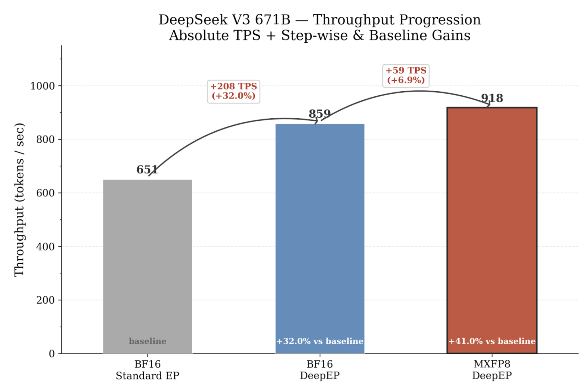

# DeepSeek-V3 Pre-training with MXFP8 and DeepEP on B200 GPUs

This repository contains the Slurm job scripts and reproducibility instructions for pre-training DeepSeek-V3 (16B and 671B) on a Soperator 256-GPU B200 cluster with TorchTitan.

The recipes include MXFP8 mixed-precision training via TorchAO and DeepEP-accelerated expert communication, which together deliver up to 41% faster training throughput (tokens/sec) over BF16 without degrading convergence. For the full results and technical deep-dive, see the accompanying PyTorch blog post **[Enabling Up to 41% Faster Pre-training: MXFP8 and DeepEP for DeepSeek-V3 on B200 with TorchTitan](https://pytorch.org/blog/enabling-up-to-41-faster-pre-training-mxfp8-and-deepep-for-deepseek-v3-on-b200-with-torchtitan/)**.

## Prerequisites

- Access to a Nebius Soperator cluster:
  - 32 nodes, 8x NVIDIA B200 GPUs per node, NVLink/NVSwitch and InfiniBand interconnects
  - Shared filesystem mounted at `/mnt/data` (minimum 2 TB)
- Python 3.12+
- CUDA 12.8+ toolkit on compute nodes

## Setup

### 1. Setup environment
Pinned dependencies are inside [`requirements.txt`](requirements.txt).
```bash
# In Soperator login node
bash setup.sh
export WANDB_API_KEY=<your-key>  # Optional
```

### 2. Install DeepEP
Follow the build instructions in [/deepep](../deepep/) folder.

## Recipes

### DeepSeek-V3 671B (`train_671b.sh`)

Controls two independent knobs via environment variables:
- `mxfp8_default` — Replaces BF16 with MXFP8 on routed expert grouped GEMMs.
- `deepep` — Replaces the standard all-to-all backend with [DeepEP](https://github.com/deepseek-ai/DeepEP)'s optimized RDMA kernels for dispatch/combine.

**Parallelism:** TP=2, PP=2, EP=32, DP-shard=auto, local batch=64, seq=8192

```bash
# BF16 baseline
sbatch train_671b.sh

# BF16 + DeepEP
EP_BACKEND=deepep sbatch train_671b.sh

# MXFP8 + DeepEP  (+41% vs BF16)
RECIPE=mxfp8_default EP_BACKEND=deepep sbatch train_671b.sh
```


### DeepSeek-V3 16B MoE (`train_16b.sh`)

Used for loss convergence validation over 1,500 steps.
- `mxfp8_wgrad_hp` — Replaces BF16 with MXFP8 on both routed expert grouped GEMMs and linear layers (at TP=1).
**Parallelism:** TP=1, PP=1, EP=32, DP-shard=auto, local batch=16, seq=8192, steps=1500

```bash
# BF16 baseline
sbatch train_16b.sh

# MXFP8 with linears
RECIPE=mxfp8_wgrad_hp sbatch train_16b.sh
```

## Known Limitations

**MXFP8 on linear layers + TP:** `torch.compile` does not yet support MXFP8 linear layers when combined with tensor parallelism. The 671B config (TP=2) therefore applies MXFP8 only to grouped GEMMs, not to attention or shared-expert linear layers. Further throughput gains are expected once this support lands in TorchTitan.

## References

- [TorchTitan](https://github.com/pytorch/torchtitan)
- [TorchAO](https://github.com/pytorch/ao)
- [DeepEP](https://github.com/deepseek-ai/DeepEP)
- [Nebius Soperator](https://nebius.com/services/soperator)
