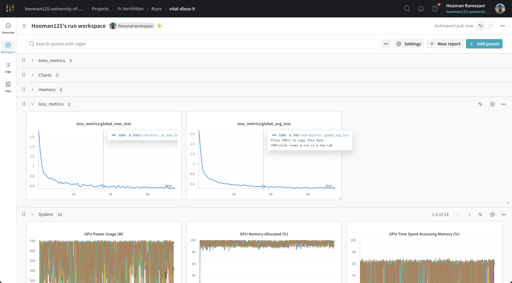

# 🧬 Running FLUX.1-schnell (12B) Text-To-Image Multi-Node Pretraining with TorchTitan and Slurm (Soperator)
This document provides a step-by-step guide to launching a pretraining job for [FLUX.1-schnell](https://github.com/black-forest-labs/flux/tree/main) with [TorchTitan](https://github.com/pytorch/torchtitan) on a Nebius Slurm (Soperator) cluster. Flux-1-Schnell (12B) is a distilled text-to-image diffusion model capable of generating high-quality images in just 1–4 sampling steps, allowing you to turn written descriptions into realistic images. We will utilize the cc12m-wds dataset that contains 12 million image-text pairs specifically meant to be used for vision and-language pre-training.

## ✅ Prerequisites
Before you start, make sure you have the following:
- Access to a [Soperator cluster](https://nebius.com/services/soperator). You can also provision a new cluster following these [steps](https://github.com/nebius/nebius-solution-library/tree/main/soperator).
- Have cloned this repo into your Soperator cluster with `git clone https://github.com/nebius/ml-cookbook.git`

## 📋 Steps

For running this workload, you will need to SSH to the login node of the Soperator cluster and clone this repository to the shared filesystem (by default, Sopeartor has `/` mounted as a shared filesystem).

### 🔧 Setup the environment

Execute the setup script with `source setup_flux.sh`. It will create a Python virtual environment, install the necessary dependencies, and grab necessary files.

### 📄 Examine the `.slurm` script and .toml configs

`multinode_flux.slurm`: This file will kick off multinode training, its setup for 2 nodes of 8xh100s at the moment. Adjust `--nodes --ntasks --nnodes --nproc_per_node --gpus-per-task --nproc_per_node` as needed for your hardware.

One notable point is that here we use a Python virtual environment with all the necessary dependencies installed. This is made possible by the fact that Soperator uses shared root filesystem which allows us to consistently use the same virtual environment on all nodes, making the setup more portable and easier to manage.

As for the configs in the `flux_schnell_model.toml` file, these will modify main training parameters. Some noteworthy options:
- `data_parallel_replicate_degree`: set equal to the number of nodes you’re training on so every node hosts one full model replica
- `data_parallel_shard_degree`:set equal to the GPUs per node so parameters are evenly sharded across local devices
- `fsdp_reshard_after_forward`: leave it false (keep parameters resident through backward) unless you’re running out of GPU memory
- `fsdp_overlap_comm`: Keep it false for safer defaults; enable (true) only after verifying your NCCL/network can overlap communication with compute.
- `fsdp_prefetch_params`: start at 2 (prefetch the next two layers), ensures gpu memory is better fed throughout training

### 📊 Flux 1 Schnell — Dataset Flow
As its currently setup load_dataset shards lazily (HTTP range-requests to grab files from HuggingFace), with an additional metadata cache on the local filesystem. datasets.distributed.split_dataset_by_node then ensures that each GPU (or data-parallel rank) sees a disjoint slice of the stream without any extra disk traffic. Some extra details:

**_Optional:_**: To improve latency, you can download the cc12m dataset locally by running the `download_CC12M.py` file. This will take advantage of the Soperator shared FS, all nodes in your cluster will reuse the same cached dataset shards instead of each node re-downloading and re-preprocessing data independently. If you choose this option, you will need to add the following lines:
```
# Add to flux_schnell_model.toml: 
[training]
    dataset_path = "/root/hf_cache/datasets/pixparse___cc12m-wds" # This line

# Add to multinode_flux.slurm:
   export HF_HOME=/root/hf_cache
   export HF_DATASETS_CACHE=/root/hf_cache/datasets
```

Some additional details about how the data is processed in this pipline:
```
1. Source & Registration
   ↪ `flux_dataset.py → DATASETS`
     Register a dataset name + loader + preprocessor. All other logic (tokenisers, encoders, dataloaders) works out of the box.

2. Per-sample Processor
   ↪ `_process_cc12m_image()`
     • Rejects small images (<256px), Rescales shorter edge to 256, random-crops square
     • Converts to RGB, normalises to [-1, 1]
     • Tokenises text twice:
         - `clip_tokens`  ➜ [1 × 77]
         - `t5_tokens`    ➜ [1 × max_t5_encoding_len]

3. FluxDataset
   ↪ Streams dataset (e.g. cc12m-wds), splits across nodes
     • Applies classifier-free guidance dropout
     • Yields: { 'image', 'clip_tokens', 't5_tokens' }

4. ParallelAwareDataloader
   ↪ Batches tuples and supports checkpoint-resume
     (via internal iterator state tracking)

5. Preprocess Data (GPU)
   ↪ `preprocess_data(...)`
     • Runs T5/CLIP encoders → text embeddings
     • Runs AutoEncoder → image latents
     • Outputs dict to feed into Flux model
```

### 🚀 Submit the job

To submitt the distributed training job, simply run:
```
sbatch multinode_flux.slurm
```

### 👀 Monitor the job

We would reccomend using wandb to monitor your TorchTitan jobs. You can do this by setting up your wandb account and logging into via CLI.

Weights and Biases will automatically send metrics to a remote server named `torchtitan` if you login with `wandb login`. When training is launched each run will receive its own name and metrics. Here is an example of the dashboard:




### 📊 Expected output

The script will run the training process on 2 nodes with 8 GPUs each (16 GPUs total) for 1 epoch. The output log  should output some setup and once training kicks off it will similar to the following:
```
[titan] 2025-06-10 21:58:27,008 - root - INFO - step: 700  loss:  0.7052  memory: 76.79GiB(96.97%)  tps: 1,541,366  tflops: 0.00  mfu: 0.00%
[titan] 2025-06-11 14:51:50,202 - root - INFO - step: 8200  loss:  0.5149  memory: 76.90GiB(97.11%)  tps: 1,567,390  tflops: 0.00  mfu: 0.00%
[titan] 2025-06-11 15:05:19,178 - root - INFO - step: 8300  loss:  0.5146  memory: 76.82GiB(97.01%)  tps: 1,555,416  tflops: 0.00  mfu: 0.00%
```