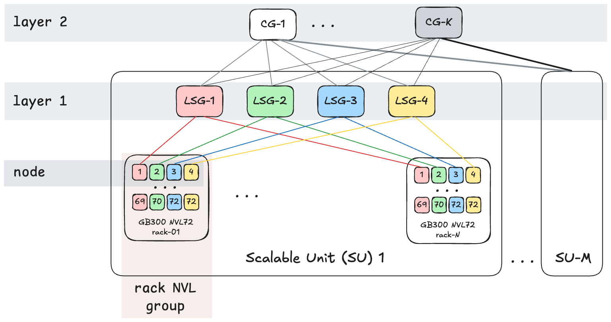

# Topology-aware scheduling on Nebius

Topology-aware scheduling (TAS) places a distributed workload using the
physical GPU and network hierarchy, not just the number of free GPUs. This is
especially important on GB200 and GB300: GPUs within one NVLink rack have a
different communication path from GPUs in another rack, and racks may also
belong to different InfiniBand scale units or partitions.



This guide builds one concrete placement:

- 32 Kubernetes Pods or Slurm nodes;
- 4 GPUs and 4 local processes per node (`torchrun` on Kubernetes, native
  Slurm tasks on Soperator);
- 128 global ranks;
- node ranks 0-15 (global ranks 0-63) in one rack;
- node ranks 16-31 (global ranks 64-127) in a second rack;
- both racks constrained to one `gpu-cluster-id`.

That is the Kubernetes equivalent of a 32-node Slurm step with 16-node
segments and block rank distribution.

## The Nebius topology boundary

Managed Kubernetes nodes provisioned in a Nebius GPU cluster carry topology
labels such as:

| Label | Meaning in this guide | How it is used |
| --- | --- | --- |
| `topology.nebius.com/gpu-cluster-id` | GPU-cluster/InfiniBand partition boundary | Outer constraint for all workers |
| `topology.nebius.com/nvl-instance-group-id` or `topology.nebius.com/tier-0` | Rack-scale NVLink domain | Two 16-node segments |
| `topology.nebius.com/tier-1` and `tier-2` | InfiniBand fabric hierarchy | Useful for other locality policies |
| `kubernetes.io/hostname` | One node | Leaf of the scheduler topology |

The two racks in a small cluster may share the same tier-1 scale unit. A
larger production cluster can span scale units, however, so tier-1 is not a
reliable substitute for the outer constraint. `gpu-cluster-id` is used in
every example because it identifies the common GPU-cluster/IB-partition
boundary.

Inspect the labels before installing or submitting anything:

```bash
kubectl get nodes -l node.kubernetes.io/instance-type=gpu-gb300 \
  -L topology.nebius.com/gpu-cluster-id \
  -L topology.nebius.com/nvl-instance-group-id \
  -L topology.nebius.com/tier-1
```

See the Nebius documentation for [GPU clusters and InfiniBand](https://docs.nebius.com/kubernetes/gpu/clusters)
and [GPU topology labels](https://docs.nebius.com/compute/clusters/gpu/topology/manage).

## One workload, four scheduler integrations

The Kubernetes examples deliberately share
[`common/megatron-scripts.yaml`](common/megatron-scripts.yaml). It launches the
same Megatron Bridge Qwen3 235B-A22B test everywhere:

| Setting | Value |
| --- | --- |
| Container | `nvcr.io/nvidia/nemo:26.06` |
| Nodes / GPUs | 32 nodes, 4 GPUs per node, 128 GPUs total |
| Parallelism | TP 1, PP 4, VP 12, CP 1, EP 32, ET 1 |
| Batch | global 8192, micro 2 |
| Runtime | Kubernetes: `torchrun`, four local processes per Pod; Slurm: four native tasks per node |
| Device access | NVIDIA device plugin, host InfiniBand, rack-local static IMEX |

There is intentionally no DRA `ResourceClaim`: these clusters already use
static IMEX configuration per rack, and the installed NVIDIA device plugin
fulfils `nvidia.com/gpu` requests. Only the controller-specific node-rank
source, rendezvous DNS, workload lifecycle, and topology syntax differ.

## Choose a scheduler

| Scheduler | Workload API | Segment expression | Runbook |
| --- | --- | --- | --- |
| Kueue 0.19 | Indexed `batch/v1` Job | One multi-layer TAS annotation: 32 at GPU cluster, 16 at rack | [Kueue](kueue/README.md) |
| KAI 0.17 | PyTorchJob or LeaderWorkerSet | Automatic controller segments | [KAI](kai/README.md) |
| KAI 0.17 | Two Indexed Jobs plus PodGroup | Explicit root and two leaf subgroups | [KAI](kai/README.md#native-indexed-jobs-with-an-explicit-podgroup) |
| Volcano 1.15 | Volcano Job | Job-level GPU cluster constraint plus `partitionPolicy` 2 x 16 | [Volcano](volcano/README.md) |
| Soperator / Slurm | `sbatch` script or `srun` command | `--segment=16` with block rank distribution | [Soperator](soperator/README.md) |

Each directory contains only the manifests or batch file needed for that
scheduler and a README with submission commands. Do not apply configurations
for several Kubernetes schedulers to the same test workload; choose one
runbook and run one 128-GPU example at a time.

## Segments, ranks, and what to verify

For Kubernetes, TAS schedules Pods and `torchrun` assigns process ranks. The
two line up because every workload controller exposes a stable node index and
the shared launcher uses it as `--node_rank`. Four local processes then turn
node ranks 0-15 into global ranks 0-63 and node ranks 16-31 into global ranks
64-127. For Slurm, block task distribution starts four native tasks per node;
the Enroot PyTorch hook maps Slurm process and local IDs to the equivalent
PyTorch rank environment.

Gang admission is also essential. Starting only part of a 32-node job would
leave nonzero ranks waiting for a rendezvous that cannot complete. All examples
therefore require the full 32-Pod workload, or both 16-Pod subgroups, before
useful work starts.

Finally, a request for two logical 16-Pod segments does not universally mean
two distinct rack label values. On the two-rack test cluster, a rack has fewer
than 32 eligible four-GPU nodes, so both complete segments cannot fit in one
rack. On a different topology, verify the assigned
`nvl-instance-group-id` values and use a scheduler-specific distinct-domain
mechanism.

## Before submitting

Confirm all of the following:

- provisioned mk8s cluster with [Nebius recipe](https://github.com/nebius/nebius-solutions-library/tree/main/k8s-training) with at least 2 GB300 racks;
- both racks are a part of the same expected `gpu-cluster-id`;
- the NVIDIA device plugin advertises four allocatable GPUs per selected node;
- `/dev/infiniband` and `/dev/nvidia-caps-imex-channels` exist on the hosts (should be the case if provisioned with default Nebius configuration);
- the scheduler/controller versions match the chosen runbook;
- the `hf-token` Secret exists for Kubernetes, or `HF_TOKEN` is exported before
  Slurm submission.

Then continue with the [Kueue](kueue/README.md), [KAI](kai/README.md),
[Volcano](volcano/README.md), or [Soperator](soperator/README.md) runbook.
